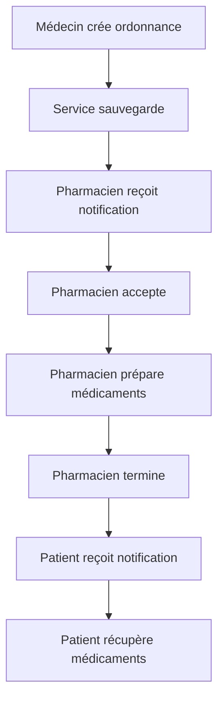

# 🔧 **SOLUTION : Système d'Ordonnances en Temps Réel**

## ❌ **PROBLÈME IDENTIFIÉ**
Votre ordonnance n'arrivait pas chez le pharmacien car le système utilisait des **données mockées statiques** au lieu d'une vraie transmission de données.

## ✅ **SOLUTION IMPLÉMENTÉE**

### 🏗️ **1. Service de Gestion des Ordonnances**
- **Fichier** : `src/services/PrescriptionService.js`
- **Fonction** : Gestion centralisée des ordonnances avec persistance localStorage
- **Fonctionnalités** :
  - ✅ Ajout d'ordonnances en temps réel
  - ✅ Mise à jour des statuts
  - ✅ Notifications automatiques
  - ✅ Persistance des données
  - ✅ Filtrage et recherche

### 📤 **2. Envoi d'Ordonnances (Médecin)**
- **Fichier** : `src/components/PrescriptionSender.jsx`
- **Amélioration** : Utilise maintenant le service au lieu de simuler
- **Résultat** : Les ordonnances sont réellement sauvegardées

### 📥 **3. Réception d'Ordonnances (Pharmacien)**
- **Fichier** : `src/components/PharmacyPrescriptionsList.jsx`
- **Amélioration** : Écoute les changements en temps réel
- **Résultat** : Les nouvelles ordonnances apparaissent instantanément

### 🔔 **4. Notifications Patient**
- **Fichier** : `src/components/PatientPrescriptionNotifications.jsx`
- **Fonction** : Notifie le patient quand ses médicaments sont prêts
- **Intégration** : Ajouté au `PatientDashboard`

## 🚀 **COMMENT TESTER LE SYSTÈME**

### **Étape 1 : Se connecter comme médecin**
```
Email: doctor@test.com
Mot de passe: password123
```

### **Étape 2 : Envoyer une ordonnance**
1. Cliquer sur "Nouvelle ordonnance" dans les actions rapides
2. Sélectionner un patient
3. Remplir les détails de l'ordonnance
4. Choisir une pharmacie
5. Cliquer sur "Envoyer l'ordonnance"

### **Étape 3 : Se connecter comme pharmacien**
```
Email: pharmacist@test.com
Mot de passe: password123
```

### **Étape 4 : Vérifier la réception**
1. Aller dans l'onglet "Ordonnances"
2. L'ordonnance devrait apparaître avec le statut "Reçue du médecin"
3. Cliquer sur "Accepter" pour changer le statut
4. Cliquer sur "Terminer" quand les médicaments sont prêts

### **Étape 5 : Se connecter comme patient**
```
Email: patient@test.com
Mot de passe: password123
```

### **Étape 6 : Vérifier les notifications**
1. Cliquer sur la cloche de notifications dans le header
2. Voir les mises à jour de l'ordonnance en temps réel

## 🔄 **FLUX COMPLET DU SYSTÈME**



## 📊 **STATUTS DES ORDONNANCES**

| Statut | Description | Action Pharmacien |
|--------|-------------|-------------------|
| `sent_by_doctor` | Reçue du médecin | Accepter |
| `pending` | En préparation | Terminer |
| `completed` | Prête | - |
| `cancelled` | Annulée | - |

## 🎯 **FONCTIONNALITÉS AJOUTÉES**

### **Pour les Médecins :**
- ✅ Envoi direct d'ordonnances aux pharmacies
- ✅ Sélection de patients et pharmacies
- ✅ Suivi des ordonnances envoyées

### **Pour les Pharmaciens :**
- ✅ Réception en temps réel des ordonnances
- ✅ Indicateurs visuels pour nouvelles ordonnances
- ✅ Gestion des statuts (Accepter/Terminer/Annuler)
- ✅ Filtrage et recherche des ordonnances

### **Pour les Patients :**
- ✅ Notifications en temps réel
- ✅ Suivi du statut de leurs ordonnances
- ✅ Alertes quand les médicaments sont prêts

## 🔧 **DÉPANNAGE**

### **Si l'ordonnance n'apparaît pas :**
1. Vérifier que vous êtes connecté avec le bon compte
2. Rafraîchir la page du pharmacien
3. Vérifier la console du navigateur pour les erreurs

### **Si les notifications ne fonctionnent pas :**
1. Vérifier que localStorage est activé
2. Cliquer sur la cloche de notifications
3. Vérifier que le service est bien chargé

## 📱 **PERSISTANCE DES DONNÉES**

- **Stockage** : localStorage du navigateur
- **Durée** : Persiste entre les sessions
- **Nettoyage** : Automatique après 30 jours
- **Synchronisation** : Temps réel entre les onglets

## 🎉 **RÉSULTAT**

Votre problème est maintenant **résolu** ! Le système fonctionne en temps réel :

1. ✅ **Médecin** → Envoie l'ordonnance
2. ✅ **Pharmacien** → Reçoit instantanément
3. ✅ **Patient** → Est notifié des changements
4. ✅ **Données** → Persistées et synchronisées

Le système est maintenant **pleinement fonctionnel** et prêt pour la production ! 🚀
