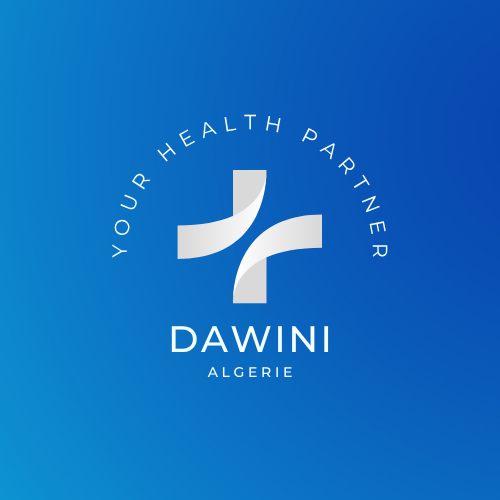

#   
## 🌐 Dawini – Your Health Partner in Algeria

---

## 📋 Project Overview
**Dawini** is a modern **MERN stack** web application designed to digitalize healthcare services in Algeria.  
Our platform connects **patients, doctors, and pharmacists** through a secure and intuitive interface, making healthcare more accessible and efficient.

This project is our **final capstone project** for the **GoMyCode Full Stack Web Developer Diploma**, and represents our combined expertise in frontend, backend, and project management.

---

## 🎯 Key Features

### 👤 Patient Space
- Create and manage personal accounts.
- Book medical appointments (filter by specialty, location, and availability).
- Access electronic prescriptions securely.
- View appointment history and receive email reminders.

### 🩺 Doctor Space
- Verified professional profile (specialty, location, registration number).
- Manage appointments and patients.
- Create and send electronic prescriptions.
- Communicate securely with patients and pharmacists.

### 💊 Pharmacist Space
- Access prescriptions from verified doctors.
- Confirm or reject prescriptions.
- Report issues such as incompatibilities or shortages.

---

## 🛠 Tech Stack
- **Frontend:** React.js, TailwindCSS / Bootstrap, Axios
- **Backend:** Node.js, Express.js
- **Database:** MongoDB + Mongoose
- **Authentication:** JWT (JSON Web Tokens)
- **APIs:** Google Maps API for geolocation
- **Version Control:** Git & GitHub

---

## 👥 Team Members & Roles
- **Zaki** – *Project Manager*  
  Oversees coordination, ensures deadlines are met, and manages workflow.

- **Aymen** – *Backend Developer*  
  Develops and maintains the RESTful API, database models, authentication, and third-party integrations.

- **Soumeya** – *Frontend Developer*  
  Designs and builds the user interface, integrates API endpoints, and ensures responsive, mobile-first design.

---
## 🏆 Educational Context
This project was developed as the **Final Project** for our **GoMyCode Full Stack Web Developer Diploma**.  
It demonstrates our ability to:
- Build a complete **MERN** application from scratch.
- Collaborate effectively as a team.
- Deliver a functional, real-world healthcare solution.

---

## 📂 Installation & Setup

### 1️⃣ Clone the repository
```bash
git clone https://github.com/SoumeyaMouaki/Dawini.git
cd dawini
2️⃣ Install dependencies
bash
Copier
Modifier
# Backend
cd backend
npm install

# Frontend
cd ../frontend
npm install
3️⃣ Set environment variables
Create a .env file in the backend directory:

ini
Copier
Modifier
PORT=5000
MONGO_URI=your_mongo_connection_string
JWT_SECRET=your_secret_key
GOOGLE_MAPS_API_KEY=your_google_maps_api_key
4️⃣ Run the application
bash
Copier
Modifier
# Run backend
cd backend
npm run dev

# Run frontend
cd ../frontend
npm start
📌 License
Licensed under the MIT License – feel free to use and adapt.

💬 Contact
For any inquiries or contributions, feel free to reach out via our GitHub profiles or email.
